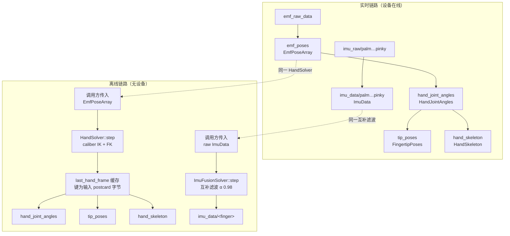

# WujiGlove 离线解算数据链路

本文说明 WujiGlove 离线解算用到哪些资源、暴露哪些接口、数据如何流动与被消费，以及每个函数的职责。源码位置以 `wuji-sdk-dev` 仓库根为基准。

## 离线解算的定义与边界

离线解算指不连接设备、不建立订阅，由调用方把已经录下来的帧逐帧传入 SDK，同步取回解算结果。它与实时链路共用同一套求解器，差别在帧的来源：实时来自设备订阅流，离线来自调用方传入的内存对象。

离线覆盖的范围：

| 类别 | 链路 |
| --- | --- |
| 覆盖 | `EmfPoseArray` → `HandJointAngles`、`FingertipPoses`、`HandSkeleton`（一次 IK 加 FK 同时出三件） |
| 覆盖 | raw `ImuData` → 融合 `ImuData`，6 条独立支链（palm、thumb、index、middle、ring、pinky） |
| 不覆盖 | `emf_raw_data` → `emf_poses` 这一段 EMF 解算与后处理，输入的位姿必须已经算好 |
| 不覆盖 | `tactile_point_cloud`、`tf`、`tf_static` |
| 不覆盖 | `synthesized/*` 与 `kf_imu/*`（admin_only 的 EMF 加 IMU 融合族） |
| 不覆盖 | WujiHand2 与其他设备类型 |

## 实时链路与离线链路的对应



实时链路里 `emf_poses` 从 `emf_raw_data` 解算而来，`hand_joint_angles` 消费 `emf_poses`，`tip_poses` 与 `hand_skeleton` 消费 `hand_joint_angles`，`imu_data/<finger>` 消费 `imu_raw/<finger>`。离线把这条链的中间产物当作入口：调用方提供 `EmfPoseArray`，等价于提供 `emf_poses` 的输出。

## 资源与 schema

| 资源 | schema | schema id | 离线中的角色 |
| --- | --- | --- | --- |
| `emf_poses` | `EmfPoseArray` | `0x8001` | 输入，等价物。内容为 5 个 `EmfPose`（`Pose` 加 `confidence`）加 `FrameHeader` |
| `imu_raw/<finger>` | `ImuData` | `0x0105` | 输入，raw 形态 |
| `hand_joint_angles` | `HandJointAngles` | `0x8005` | 输出。`fingers` 为 5 个 `FingerJointAngles`，每个含 `angles: [f64; 5]` 与 `confidence` |
| `tip_poses` | `FingertipPoses` | `0x8003` | 输出。5 个 `FingertipPose`（`Pose` 加 `confidence`） |
| `hand_skeleton` | `HandSkeleton` | `0x8006` | 输出。21 个 `SkeletonJoint`（`name`、`pose`、`confidence`） |
| `imu_data/<finger>` | `ImuData` | `0x0105` | 输出，fused 形态 |

schema 定义在 `crates/idl/schemas/`（`transform.yaml` 里的 `EmfPose` 与 `EmfPoseArray`、`hand.yaml` 里的手部三个、`imu.yaml`、`common.yaml` 里的 `FrameHeader`），由 IDL codegen 生成到 `wuji_core::schemas`。虚拟资源的声明在 `crates/idl/virtual/wuji_glove.yaml`，物理话题在 `crates/idl/devices/wuji_glove.yaml`。

21 个关节角按五指顺序拼接：拇指 5 个（`angles[0..5]` 全部有效），其余四指各 4 个（`angles[0..4]` 有效，`angles[4]` 恒为 `0.0`）。

## 公开接口

### Rust

`crates/sdk/src/devices/wuji_glove/offline_pipeline/mod.rs`：

```rust
WujiGlove::offline_pipeline(
    sn: impl Into<String>,
    hand_side: Handedness,
    opts: OfflinePipelineOptions,   // { urdf_path: Option<PathBuf> }
) -> Result<WujiGloveOfflinePipeline>
```

`WujiGloveOfflinePipeline` 的属性与方法：

| 成员 | 返回 | 说明 |
| --- | --- | --- |
| `sn()` | `String` | 构造时的 SN |
| `hand_side()` | `Handedness` | 构造时的手别 |
| `urdf_source()` | `UrdfSource` | 实际生效的 URDF 来源 |
| `urdf_source_path()` | `Option<PathBuf>` | 来源为该文件时给出路径 |
| `hand_joint_angles()` | `WujiOfflineHandJointAnglesResource` | 轻量 wrapper |
| `tip_poses()` | `WujiOfflineTipPosesResource` | 轻量 wrapper |
| `hand_skeleton()` | `WujiOfflineHandSkeletonResource` | 轻量 wrapper |
| `imu_data_palm()` 等 6 个 | `WujiOfflineImuDataResource` | 每根手指一个 wrapper，各自持有 `FingerSlot` |

四个资源的 `compute`：

```rust
WujiOfflineHandJointAnglesResource::compute(&self, input: &EmfPoseArray) -> Result<HandJointAngles>
WujiOfflineTipPosesResource::compute(&self, input: &EmfPoseArray) -> Result<FingertipPoses>
WujiOfflineHandSkeletonResource::compute(&self, input: &EmfPoseArray) -> Result<HandSkeleton>
WujiOfflineImuDataResource::compute(&self, raw: &ImuData) -> Result<ImuData>
```

命名对仗实时链路：实时是 `glove.<resource>().subscribe()`，离线是 `pipeline.<resource>().compute(input)`。

### Python

`crates/sdk-python/src/wuji_glove_ext.rs` 里以 `#[staticmethod]` 挂在 `WujiGlove` 上，`crates/sdk-python/src/offline_pipeline_ext.rs` 定义 5 个 `#[pyclass]`。

```python
pipeline = WujiGlove.offline_pipeline(
    sn="WujiGlove-12345",
    hand_side="right",        # 字符串 "left" / "right"
    urdf_path=None,           # 可选 override
)

pipeline.sn                 # str
pipeline.hand_side          # "left" / "right"
pipeline.urdf_source        # "override" / "calibration_file" / "builtin_default"
pipeline.urdf_source_path   # str | None

pipeline.hand_joint_angles().compute(emf_poses)   # HandJointAngles
pipeline.tip_poses().compute(emf_poses)           # FingertipPoses
pipeline.hand_skeleton().compute(emf_poses)       # HandSkeleton
pipeline.imu_data_palm().compute(raw_imu)         # ImuData
```

类型存根在 `crates/sdk-python/wuji_sdk.pyi` 的手写区（`OfflineHandJointAnglesResource`、`OfflineTipPosesResource`、`OfflineHandSkeletonResource`、`OfflineImuDataResource`、`WujiGloveOfflinePipeline`）。Python 侧 9 个 accessor 每次调用返回新的轻量 wrapper，但共享同一个 `Arc<Mutex<OfflinePipelineInner>>`。

### C 侧接口（当前缺口）

`crates/sdk-c` 里没有任何离线解算符号，`crates/sdk-c/include/wuji_sdk.h` 也没有。契约 `crates/idl/contract/sdk-api-contract.yaml` 把 `WujiGlove.offline_pipeline`、`WujiGloveOfflinePipeline.*`、`Offline*Resource.*` 登记在 `surface_only.python` 下，`docs/internal/reference/api-parity-table.md` 中对应的 C 列是 `—`。

C 侧要新增的是一组不透明句柄函数，输入输出全部复用头文件里已有的结构体（`WujiEmfPoseArray`、`WujiImuData`、`WujiHandJointAngles`、`WujiFingertipPoses`、`WujiHandSkeleton`），手别用已有的 `WujiHandedness` 枚举。函数形态（候选）：

```c
WujiStatus wuji_glove_offline_pipeline_create(
    const char *sn, int32_t hand_side, const char *urdf_path, /* NULL 表示不指定 */
    struct WujiGloveOfflinePipeline **out);
WujiStatus wuji_glove_offline_hand_joint_angles_compute(
    struct WujiGloveOfflinePipeline *pipe, const struct WujiEmfPoseArray *in,
    struct WujiHandJointAngles *out);
WujiStatus wuji_glove_offline_tip_poses_compute(...);
WujiStatus wuji_glove_offline_hand_skeleton_compute(...);
WujiStatus wuji_glove_offline_imu_data_compute(
    struct WujiGloveOfflinePipeline *pipe, int32_t finger, const struct WujiImuData *in,
    struct WujiImuData *out);
void wuji_glove_offline_hand_joint_angles_free(struct WujiHandJointAngles *out);
void wuji_glove_offline_pipeline_free(struct WujiGloveOfflinePipeline *pipe);
```

沿用仓库既有约定：句柄是 `*mut Arc<...>`，参数校验失败返回 `WUJI_STATUS_ERR_INVALID_ARG` 并写 `wuji_last_error`，库错误走 `record(&e)`（参考 `crates/sdk-c/src/retargeting.rs` 的 `wuji_retarget_session_create` / `_step` / `_free`）。输出结构体含指针字段，由 SDK 分配、调用方用配对的 `*_free` 释放（与 `wuji_hw_version_free` 一类既有函数一致）。`*_free` 属于手动内存管理，按契约登记到 `surface_only.c` 段（参考 `wuji_retarget_session_free`）。

契约里把三条从 `surface_only.python` 挪成一个配对操作后，Python 与 C 的对齐检查才有依据。

## 每个函数的职责

### 构造

`WujiGlove::offline_pipeline`：

1. `SdkParamStore::load(&sn, wuji_core::device_id::WUJI_GLOVE)` 读取该 SN 在磁盘上的参数存储，不存在时得到空 store。
2. `load_effective_hand_urdf(&store, hand_side, opts.urdf_path)` 选定 URDF 文本、来源与路径。
3. `HandSolver::new(selection.text.as_str(), hand_side)` 构造 IK 加 FK 求解器。
4. `ImuFusionSolver::new(DEFAULT_IMU_ALPHA)` 构造 6 路互补滤波，`DEFAULT_IMU_ALPHA` 是固定常量 `0.98`，不通过接口暴露。
5. 初始化 `last_hand_frame = None`、`tip_poses_seq = 0`。

以上任何一步失败都让构造返回 `Err`，此时没有实例可用。

### 手部三个资源

`compute` 走同一条路径，差别只在最后取哪一份输出。

`input_wire(&EmfPoseArray)`：把输入帧序列化成 postcard 字节，作为身份标识。序列化失败返回 `SdkError::Internal`。

`ensure_latest_frame(inner, input, input_wire)`：比较新输入与缓存帧的 postcard 字节。相同就直接返回，不推进求解器。不同就调 `inner.hand_solver.step(input)` 得到 `HandDerivedFrame`，把它连同输入字节存为新的 `LastHandFrame`，并把两个物化缓存清空。

`WujiOfflineHandJointAnglesResource::compute`：加锁、确保缓存最新、返回 `derived.hand_joint_angles.clone()`。这份结果的 `header` 完整镜像输入帧的 `header`。

`WujiOfflineTipPosesResource::compute`：加锁、确保缓存最新。若当前帧还没有物化过指尖位姿，则把 `tip_poses_seq` 加一（`wrapping_add`），用该序号调 `materialize_tip_poses`，结果存进缓存。返回缓存结果的克隆。

`WujiOfflineHandSkeletonResource::compute`：加锁、确保缓存最新。若当前帧还没有物化过骨架，则调 `materialize_hand_skeleton` 存进缓存。返回缓存结果的克隆。

### 求解器与物化

`HandSolver::new(urdf_text, handedness)`：用 `wuji_caliber::IkApiSolver::from_urdf_str` 从 URDF 文本构造求解器，开启五指并行（caliber 自带的并行池），再用 `urdf_rs` 解析同一份 URDF 缓存 21 个可动关节的名字与限位。URDF 缺少约定的 5 个末端关节（`thumb_rx_coil_fixed`、`index_rx_coil_fixed`、`middle_rx_coil_fixed`、`ring_rx_coil_fixed`、`pinky_rx_coil_fixed`）或可动关节数不等于 21 时构造失败。

`HandSolver::step(&EmfPoseArray)`：校验 `poses.len()` 等于 5，否则整帧返回错误且不推进状态。调 `solve_with_kinematics` 一次得到 21 个角度、5 指置信度与每指 4 个腕坐标系 landmark。校验角度：出现非有限值就拒整帧。超出 URDF 限位超过 `1e-6 rad` 时按关节限流告警，角度本身不改。最后组装 `HandJointAngles`（header 镜像输入，每指 `confidence` 为 EMF 置信度与 caliber IK 置信度的算术平均）与 `HandFkPayload`（5 个指尖位姿、21 个骨架位姿及其名字、5 指置信度），返回 `HandDerivedFrame`。

`materialize_tip_poses(derived, seq, handedness)`：输出 `FingertipPoses`。`frame_id` 取 `r_wrist` 或 `l_wrist`，`timestamp_us` 取输入帧时间戳，`seq` 用传入的 pipeline 计数器，`poses` 是 5 个指尖位姿加对应手指置信度。

`materialize_hand_skeleton(derived, handedness)`：输出 `HandSkeleton`。`frame_id` 同样取腕坐标系，`seq` 取 `hand_joint_angles.header.seq`，`joints` 是 21 个 landmark，名字按 MediaPipe 顺序（0 `wrist`，1 到 4 thumb，5 到 8 index，9 到 12 middle，13 到 16 ring，17 到 20 pinky）。第 0 个关节用五指置信度的平均值，其余按所属手指取该指置信度。

### IMU 六个资源

`WujiOfflineImuDataResource::compute(&ImuData)`：加锁后调 `inner.imu_solver.step(self.finger, raw)`。`finger` 在构造 wrapper 时固定（`palm`、`thumb`、`index`、`middle`、`ring`、`pinky`）。

`ImuFusionSolver::step(finger, raw)`：把调用分派到该手指对应的 `ImuFusionStream`，6 路状态互相独立。

`ImuFusionStream::step(raw)`：调 `ImuComplementaryFilter::update` 得到当前姿态，克隆输入后填 `orientation`，并把 `orientation_covariance[0]` 置为 `0.0`。其余字段原样保留。

`ImuComplementaryFilter::update(imu)`：首帧用加速度计初始化 roll 与 pitch，yaw 置 0。后续帧按时间戳差做陀螺仪四元数积分，再用加速度计修正倾斜分量。`alpha` 越大越信任陀螺仪。加速度范数不在 `[1.0, 30.0]` 时跳过修正，只保留积分结果。相邻帧时间戳差为 0 或超过 5 秒（`MAX_INTEGRATION_DT_US`）时保持上一姿态，不积分也不修正。yaw 会随时间漂移。

### URDF 选择

`load_effective_hand_urdf(store, handedness, override_path)` 三级：

| 优先级 | 条件 | `UrdfSource` | 读失败时 |
| --- | --- | --- | --- |
| 1 | 传入 `override_path` | `Override` | 返回 `Err`，消息含路径 |
| 2 | `read_store_urdf_path` 找到可用候选 | `CalibrationFile` | 告警后回落第 3 级 |
| 3 | 内置默认 | `BuiltinDefault` | 构造成功，结果可能失真 |

`read_store_urdf_path(store, handedness, context, write_content)` 的候选顺序：`calibration.hand_model_path` 指向的文件（文件名不属于 SDK 托管路径时才算 custom 候选），否则该用户的稳定文件 `left_hand.urdf` 或 `right_hand.urdf`。default 用户或 store 未绑定用户时跳过这一级，直接回落内置默认。

与实时链路用的 `load_hand_urdf_text` 的差别在于实时版本按手别缓存在 `SdkParamStore` 并会写 `hand_model_content`，离线版本每次构造读一次、不写诊断字段。候选规则本身是同一个函数。

实时链路里 `handlers/emf_poses.rs` 也调 `load_effective_hand_urdf`（用于 EMF 位姿的可达性约束），因此离线与实时选 URDF 的规则天然一致。

### Python 绑定

`PyWujiGlove::offline_pipeline`：校验 `hand_side` 字符串，平铺 `OfflinePipelineOptions`，调 Rust 构造器，把 `SdkError` 映射成 Python 异常。

`PyWujiGloveOfflinePipeline`：`urdf_source` getter 把 `UrdfSource` 枚举转成 `"override"` / `"calibration_file"` / `"builtin_default"`，`hand_side` getter 把 `Handedness` 转成 `"left"` / `"right"`，9 个 accessor 各自包一层 Rust 的同名 wrapper。

4 个 `PyOffline*Resource::compute`：把 Python 对象转成 Rust schema（`input.into()`），调用 Rust `compute`，把结果转回 Python 对象（`Into::into()`），错误走 `sdk_error_to_py_err`。没有额外的计算逻辑。

## 头部字段与帧 ID 规则

| 输出 | `frame_id` | `seq` | `timestamp_us` |
| --- | --- | --- | --- |
| `hand_joint_angles` | 镜像输入（`r_hand_emf_tx` / `l_hand_emf_tx`） | 镜像输入 | 镜像输入 |
| `tip_poses` | `r_wrist` / `l_wrist` | 本资源计数器，第一次成功物化为 `1` | 输入帧时间戳 |
| `hand_skeleton` | `r_wrist` / `l_wrist` | 等于 `hand_joint_angles` 的 `seq`，即输入 `seq` | 镜像输入 |
| `imu_data/<finger>` | 镜像 raw 输入 | 镜像输入 | 镜像输入 |

`tip_poses` 用的是 pipeline 自己的发出计数器，与输入 `seq` 无关。同一输入帧重复调用不会让它递增。

raw IMU 输入用 `orientation_covariance[0] == -1.0` 表示尚未融合（`ImuData::raw` 构造器按此标记），融合输出的同一位置是 `0.0`。SDK 不拒绝未带该哨兵的输入，会照常融合并覆盖 `orientation`。

## 状态与缓存语义

单帧去重是正确性约束，不是性能优化。caliber IK 有状态，每帧解算以上一帧位姿作为种子。同一输入帧若被反复解算，求解器状态会被多推进几次，后续帧的结果随之偏离实时链路。

- 缓存只保留最近一帧，键是输入的完整 postcard 字节。不按 `timestamp_us` 匹配，因为合成数据或时间戳重置会让不同帧共享同一时间戳。
- 不同帧之间不复用。调用顺序为 `A`、`B`、`A` 时第三次必须重新解算，因为状态已被 `B` 推进。
- 手部三个资源共享同一次 `HandSolver::step`。典型批处理按 `hand_joint_angles`、`tip_poses`、`hand_skeleton` 的顺序对同一帧各调一次，只解算一次。
- IMU 每路无缓存，逐帧推进滤波状态。
- 单实例内的所有 `compute` 通过内部互斥锁串行执行，调用顺序即状态推进顺序。需要并行处理多路数据时，创建多个实例。想从头开始也通过新建实例实现，没有重置接口。
- URDF 在构造时固定。重新标定之后要让新模型生效，需要新建实例。

## 错误语义

| 场景 | 行为 |
| --- | --- |
| `hand_side` 不是 `left` 或 `right`（Python） | 抛 `WujiException` |
| 显式 `urdf_path` 读不到 | 构造失败，消息含路径 |
| store 里的标定路径读不到或指向相反手 | 不报错，回落内置默认，`urdf_source == "builtin_default"` |
| URDF 无法构造求解器 | 构造失败 |
| `EmfPoseArray.poses.len()` 不等于 5 | `compute` 返回错误，不推进求解器状态 |
| 输入帧序列化失败 | `compute` 返回错误，不推进求解器状态 |
| caliber 返回非有限角度 | 该帧返回错误 |
| 角度超出 URDF 限位 | 限流告警，输出不截断 |
| 手部资源的互斥锁中毒 | 当前实现直接 `unwrap`，即 panic |
| IMU 资源的互斥锁中毒 | 返回 `SdkError::Internal` |

## 使用须知

- 输入的 SN 必须是采集数据那台设备或已完成标定的设备的 SN。填了不存在的 SN 不会报错，但会静默使用内置默认 URDF，解算精度下降。批处理脚本开头检查 `urdf_source` 是否符合预期。
- 录像里要保存 `emf_poses` 的输出，不能用 `emf_raw_data` 的原始 ADC 数据，后者不在离线覆盖范围内。
- 手部 IK 输出依赖 URDF，同一份输入的指尖位姿与关节角随 URDF 变化。IMU 融合不依赖 URDF，也不依赖任何 per-SN 标定。
- `tip_poses` 的 `seq` 是本资源计数器，与实时录像里的 `seq` 不保证相等，跨端对比时按 payload 与时间戳比较。
- 实时录制再离线重放时，两边都要从空状态开始消费同一帧序列，且每帧对同一组资源各调一次，`seq` 才能严格对齐。

## 一致性验证现状

| 文件 | 覆盖 |
| --- | --- |
| `crates/integration-tests/tests/offline_pipeline_parity.rs` | header 规则（`hand_joint_angles` 镜像输入、`tip_poses` 序号从 1 起、`hand_skeleton` 镜像输入）、payload 形状稳定、IMU 保留输入 header 与载荷并把 `orientation_covariance[0]` 置 `0.0` |
| `crates/sdk/src/devices/wuji_glove/offline_pipeline/mod.rs` 的 `#[cfg(test)]` 段 | 同帧复用只解算一次、`A` 到 `B` 到 `A` 解算三次、IMU 资源保留 raw header |
| `crates/sdk-python/tests/test_offline_pipeline.py` | 构造器与 schema 构造器可用、三件输出与 IMU 输出可用、`tip_poses` 与 `hand_skeleton` 的 `seq` 规则、非法 `hand_side` 抛 `WujiException` |
| `crates/sdk-python/examples/wujiglove/semantic_api/online_offline_mcap_parity.py` | 联网录 MCAP，再按时间戳重放离线并与在线逐字段比较（`hand_joint_angles` 与 `hand_skeleton` 比较 `seq`，`tip_poses` 只比载荷与时间戳） |

## C 侧落地要点

- 输入输出复用 `crates/sdk-c/include/wuji_sdk.h` 里已有的 `WujiEmfPoseArray`、`WujiEmfPose`、`WujiImuData`、`WujiHandJointAngles`、`WujiFingerJointAngles`、`WujiFingertipPoses`、`WujiHandSkeleton`、`WujiSkeletonJoint`，以及 `WujiHandedness` 枚举。这些结构体目前只被 typed-subscribe 包装使用（`wuji_glove_subscribe_emf_poses`、`wuji_glove_subscribe_tip_poses`、`wuji_glove_subscribe_hand_joint_angles`、`wuji_glove_subscribe_hand_skeleton`、`wuji_glove_subscribe_imu_data_*`）。
- 离线实例不绑定设备，不能复用 `struct WujiDevice *` 句柄，需要一个不依赖连接的不透明句柄，形态参考 `wuji_retarget_session_*`。
- compute 的十个入口（3 手部加 6 IMU 合并为一个带 finger 参数的入口）与 4 类输出的 `_free` 需要出现在契约的配对操作与 `surface_only.c` 中，`api-parity-table.md` 里的 `—` 随之更新。
- 示例落在 `public/examples/c/wuji_glove/`，该目录的 `CMakeLists.txt` 逐条列举 demo，需要同步加入。C SDK 条目写入 `public/CHANGELOG.md`。

## 相关文档

- 设计文档 `docs/internal/design/2026-05/2026-05-20-offline-pipeline.md`，离线 pipeline 的原始设计（api 形态、缓存约束、header 与 seq 规则、验证策略）
- 架构文档 `docs/internal/architecture/09-hand-tracking-pipeline.md`，手部追踪链路的四个阶段、IMU 融合算法、IK 求解与输出契约
- `docs/internal/reference/api-parity-table.md`，Python 与 C 的接口对齐表
